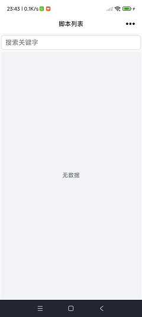

# Auto-Script (Android Automation Assistant) 🚀

English|[简体中文](./README.md)

[](LICENSE) []() [](https://openjdk.org/projects/jdk/11/) []() [](https://developer.android.com/about/versions/oreo)

**Auto-Script** is an Android automation tool built with Java.
It helps users automate repetitive tasks by recording gestures and key events, converting them into reusable scripts, and replaying them automatically to simulate taps, swipes, and task flows.

---

## 🌐 Project Links

GitHub:[https://github.com/Dylan-lijl/auto-script](https://github.com/Dylan-lijl/auto-script) <br>
gitee: [https://gitee.com/Dylan-lijl/auto-script](https://gitee.com/Dylan-lijl/auto-script)

> If you encounter any issues, please submit them in GitHub Issues.

---
## ⬇️ Download

- GitHub: [https://github.com/Dylan-lijl/auto-script/releases](https://github.com/Dylan-lijl/auto-script/releases)
- gitee: [https://gitee.com/Dylan-lijl/auto-script/releases](https://gitee.com/Dylan-lijl/auto-script/releases)
---
## 📺 Demo

A quick demonstration of script recording and playback:

**Watch demo video:**
[doc/demo.mp4](doc/demo.mp4) | [game demo](https://www.bilibili.com/video/BV1AMDyBWEjY/)

   


---

## ✨ Key Features

- 🧩 **Modular Architecture**
  Organized into independent modules (`app`, `ui-components`, `components-rules`) for easier maintenance and extensibility.
- 🎨 **Modern UI**
  Built with the **QMUI framework**, providing a clean and smooth Android-native experience.
- 🎬 **Script Recording & Playback**
  Record gestures and key operations, convert them into scripts, and replay them with mirrored behavior.
- 🔄 **Version Check**
  Built-in update checking for the latest features and fixes.

---

## 📂 Project Structure

```text
auto-script/
├── app/                # Main application module (core logic)
├── ui-components/      # UI component library based on QMUI
├── components-rules/   # XML validator for component configs
├── doc/                # Documentation and demo media
├── gradle/             # Gradle configuration
└── build.gradle        # Root build script
```

---

## 🛠️ Build & Install

### 1. Clone repository

```bash
git clone https://github.com/Dylan-lijl/auto-script.git
```

### 2. Requirements

- Android Studio Dolphin or newer
- JDK 11+
- Android SDK API 21+
- Lombok plugin

### 3. Build

Open the project in Android Studio, wait for Gradle sync, then click **Run** to install on a device or emulator.

---

## 📝 Usage Guide

1. **Grant Permissions**: Before running the app, you must manually enable the **Accessibility Service** and **Floating Window (overlay) permission**, or have **root access**; otherwise, the script cannot simulate clicks.
2. **Create / Import Rules**: On the script list page, tap **Record Script** to start recording. After recording, you can go to the details page to continue adding, editing, or deleting actions such as taps, swipes, and long presses.
3. **Run the Script**: Tap the floating **Start** button, switch to the target app, and the script will automatically execute according to the predefined rules.

---

## 🤝 Contributing

## 📜 License

This project is licensed under the [MIT License](LICENSE).
